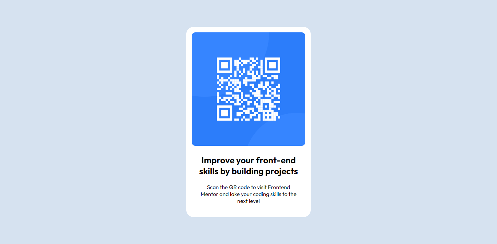

# Frontend Mentor - QR code component solution

This is a solution to the [QR code component challenge on Frontend Mentor](https://www.frontendmentor.io/challenges/qr-code-component-iux_sIO_H). Frontend Mentor challenges help you improve your coding skills by building realistic projects. 

## Table of contents

- [Overview](#overview)
  - [Screenshot](#screenshot)
  - [Links](#links)
- [My process](#my-process)
  - [Built with](#built-with)
  - [What I learned](#what-i-learned)
  - [Continued development](#continued-development)
  - [Useful resources](#useful-resources)
- [Author](#author)
- [Acknowledgments](#acknowledgments)

## Overview

### Screenshot



### Links

- Solution URL: [Add solution URL here](https://your-solution-url.com)
- Live Site URL: [Add live site URL here](https://your-live-site-url.com)

## My process

### Built with

- Semantic HTML5 markup
- CSS custom properties
- Flexbox
- CSS Grid
- Mobile-first workflow

### What I learned

I have learned how to center a div vertically and horizontally.

See below to learn how to do that:

```html
<div class="container">
  <div class="content">
    <!-- Your content here -->
  </div>
</div>
```
```css
.container {
  display: flex;
  align-items: center; /* Vertical center alignment */
  justify-content: center; /* Horizontal center alignment */
  height: 100vh; /* Set the container height to full viewport height */
}

.content {
  /* Add styling to your content */
}
```

### Useful resources

- [Example resource 1](https://chat.openai.com) - This helped me for a lot of things. This is a AI chat bot and when we ask how to do a thing, it will tell us more clearly.

## Author

- Website - [Maleesha Pramud](https://www.klmaleeshapramud.ml)
- Frontend Mentor - [@maleeshapramud2005](https://www.frontendmentor.io/profile/maleeshapramud2005)
- Twitter - [@LMpramudk](https://www.twitter.com/LMpramudk)

